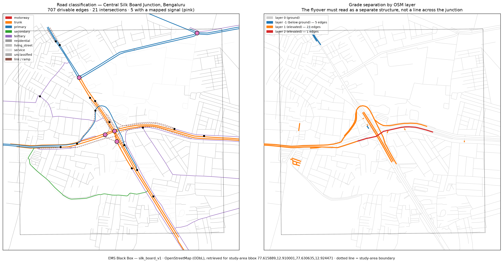

# Study area: Central Silk Board Junction

Phase 1 deliverable — the geographic foundation everything else is built on.

**Status:** acquired and validated. Not yet converted to SUMO (Phase 2), and not
yet reviewed against imagery by a human — see [Before Phase 2](#before-phase-2).



*Left: road classification, with intersections (black) and those having a mapped
traffic signal (pink). Right: grade separation by OSM `layer`. The flyover reads
as a separate structure crossing the ground network, which is the property the
whole study depends on. Dotted line is the study-area boundary. Data ©
OpenStreetMap contributors, ODbL 1.0.*

---

## Source

| | |
|---|---|
| Source | OpenStreetMap, via the Overpass API |
| Endpoint served by | `https://overpass.kumi.systems/api/interpreter` |
| Licence | ODbL 1.0 |
| Attribution | © OpenStreetMap contributors, ODbL 1.0 |
| Retrieved | 2026-09-09T16:12:40Z |
| SHA-256 | `7531944338ea8dc55311095f42b456270b1e804b1ebf93e55a2bd2a507169804` |
| Size | 4,800,643 bytes |
| Classification | **`PUBLICLY_SOURCED_DATA`** |

The primary Overpass instance (`overpass-api.de`) is unreachable from this
machine; the download automatically fell through to the community mirror, and the
attempt log is recorded in the provenance record. A third fallback — the OSM
editing API's `/map` call — is configured but was not needed.

**Not `VERIFIED_REAL_DATA`.** OSM is real and citable, and it is
community-maintained rather than surveyed by this project. We have not been to
the junction. Claiming verification would overstate what has been done.

---

## Bounding box

```
W,S,E,N = 77.615889, 12.910001, 77.630635, 12.924471
```

1600 × 1600 m (2.56 km²), square **in metres**, centred on:

```
12.917236 N, 77.623262 E
```

### How the anchor was derived

Not read off a map. It is the length-weighted centroid, in UTM 43N
(EPSG:32643), of the five OSM ways named exactly *Silk Board Flyover* or *Silk
Board Interchange*: `way/40696221`, `way/40696222`, `way/1208112302`,
`way/1208112303`, `way/1254771465`.

Two alternatives were tried and rejected:

- **Geocoding.** Nominatim returns two bus stops, a landuse polygon and a
  building for "Silk Board" — none on the carriageway.
- **The Hosur Road × Outer Ring Road crossing.** Those corridors share no node
  and do not cross in plan view: the interchange is grade-separated and connected
  only through link ways. Their nearest approach is 27.6 m apart.

The resulting anchor sits **3 m** from the nearest Silk Board flyover way and
51 m from the junction the pipeline identifies as X003 (6 nodes, 4 signals) — the
Silk Board junction itself.

### How the size was chosen

The brief asked for approximately 5–10 intersections. That target is unreachable
under a topological definition — even a 400 m box contains 12 nodes where three
or more through-roads meet, because the interchange decomposes into ramp splits
and merges and the corridors carry frequent slip roads.

"How many intersections" therefore has three answers, and all three are reported
rather than one being quietly chosen:

| Definition | Count |
|---|---|
| Nodes shared by 3+ drivable ways (side streets included) | 120 |
| Major-road junction nodes | 37 |
| Distinct major intersections (40 m clustering) | 21 |
| **Intersections with a mapped traffic signal** | **5** |

The last is the count that matches the brief, and it is also the one that governs
this project: **a signal-priority policy can only act where there is a signal.**

Larger boxes were rejected — at ~1.1 km half-extent the OSM API refuses the
request (50,000-node cap). Smaller boxes shorten the approaches without reducing
the intersection count much, and Silk Board's queues are the phenomenon under
study.

---

## What the extract contains

| | |
|---|---|
| OSM nodes | 20,283 |
| OSM ways | 4,269 (842 with a `highway` tag) |
| OSM relations | 5 |
| **Drivable road edges** | **707** |
| Junction nodes (any drivable way) | 120 |
| Distinct major intersections | 21 |
| Turn-restriction relations | 5 |
| Traffic-signal nodes | 18 |
| Metric CRS | EPSG:32643 (UTM 43N) |

**Road classes:** residential 383, service 159, trunk 48, tertiary 36, primary
25, trunk_link 24, primary_link 15, living_street 14, secondary 2, unclassified 1.

### Grade separation — the critical property

**20 bridge/viaduct edges** across **layers 0, 1 and 2**, plus **4 tunnel/
underpass edges** at layer −1. Named elevated structures found:

- Silk Board Flyover
- Silkboard Double Decker Flyover
- Silk Board Interchange
- Ragigudda-Silk Board Integrated Flyover
- Madiwala Underpass (below ground)

**39 link/ramp edges** connect the levels.

The elevated corridor is preserved as a genuinely separate structure. This is not
a nicety: a flattened flyover produces a network that converts cleanly, simulates
cleanly, and lets traffic change level for free — and nothing downstream can
detect it. The validation suite treats losing it as a hard error, and a test
asserts that Hosur Road and Outer Ring Road still share no node.

---

## Attributes preserved

Every OSM tag in `PRESERVED_WAY_TAGS` is carried through verbatim. Derived
columns sit *alongside* the originals, never replacing them.

| Required | Column(s) | Coverage |
|---|---|---|
| Latitude/longitude | `geometry` (EPSG:4326) | 100% |
| Road geometry | `geometry` (LineString, unsimplified) | 100% |
| Road direction | node order + `oneway` | 100% |
| One-way status | `oneway`, `oneway_normalised`, `oneway_basis` | 21% explicitly tagged |
| Lanes | `lanes`, `lanes:forward/backward`, `lanes_parsed` | **18%** |
| Road classification | `highway` | 100% |
| Junctions | `junctions` / `intersections` layers | derived |
| Bridges | `bridge`, `layer`, `is_bridge`, `layer_effective` | 20 edges |
| Tunnels | `tunnel`, `is_tunnel` | 4 edges |
| Ramps | `is_link`, `highway=*_link` | 39 edges |
| Service roads | `highway=service`, `service` | 159 edges |
| Turn restrictions | `turn_restrictions.json` | 5 relations |
| Speed limits | `maxspeed`, `maxspeed_kmh`, `maxspeed_status` | **12%** numeric |
| Road names | `name`, `name:en`, `name:kn`, `ref` | 29% |

**Gaps are left as null.** A missing lane count does not become a default of 2.
Lane counts drive capacity, capacity drives queue length, and queue length is
what this project reports — a guessed lane count is indistinguishable from a
surveyed one once it is in a dataframe.

---

## Limitations

These are recorded in the provenance records and must travel with any result
derived from this network.

### 1. Signal timings do not exist in this data

OSM supplies signal **locations** only — no cycle time, split or offset. None is
published for Bengaluru. **Any timing used in Phase 2 onward is
`ESTIMATED_DATA`** and must be labelled as such. This is the single most
consequential gap in the project: the baseline signal plan is the denominator of
every result.

### 2. Signal-to-intersection association is our inference

OSM does not link a `highway=traffic_signals` node to the junction it controls.
In this extract, **all 18 signal nodes have way-degree 1** — they sit on a single
approach way, set back from the junction centre. Associating them with
intersections by 60 m proximity is an inference by this project, flagged on every
row. A nearby signal node does **not** establish that the intersection is
signal-controlled today.

### 3. Current infrastructure cannot be established from OSM alone

**12 ways are tagged `highway=construction` or `proposed`** and are excluded from
the drivable network. Separately, **one way tagged as an open road is named
"Ragigudda-Silk Board Integrated Flyover (u/c)"** — tagged drivable, named
incomplete. OSM cannot resolve which is current.

This matters at Silk Board specifically, where metro construction and successive
flyover phases have been in progress for years. **Whether a given structure is
open to traffic today is not knowable from this extract**, and this limitation is
recorded rather than guessed at.

### 4. Sparse attribute coverage

Lanes on 18% of edges, numeric speed limits on 12%, names on 29%. Non-numeric
values such as `IN:urban` are deliberately left unresolved: mapping them to a
number would assert a legal default speed this project has not sourced.

### 5. Turn restrictions are sparse

5 relations (1 no_left_turn, 3 no_u_turn, 1 no_right_turn). OSM restriction
coverage in Indian cities is thin. **Absence means unmapped, not unrestricted.**

### 6. Scope truncation

The box does not cover the full Silkboard Double Decker Flyover, whose OSM ways
run ~2.8 km west toward Ragigudda. Traffic entering along that viaduct will
appear at the study-area boundary rather than from its true origin.

### 7. Approach length may prove insufficient

800 m of approach per corridor may be short relative to observed Silk Board
queues. If Phase 3 shows queues reaching the boundary, the box must be widened —
as a **new `area_id`, with runs repeated** — not reported as-is.

### 8. OSM geometry is not engineering-grade

Road centrelines are cartographic. They are not survey data and must not be
treated as accurate to design tolerances.

---

## Reproducing this

```bash
python scripts/ingest_study_area.py                  # download, validate, write
python scripts/ingest_study_area.py --validate-only  # re-check what is on disk
python scripts/plot_study_area.py                    # regenerate the figure
```

If no OSM endpoint is reachable, the pipeline **fails loudly and writes nothing**
— there is no synthesised fallback. Supply an extract manually instead:

```bash
python scripts/ingest_study_area.py --from-file path/to/extract.osm.xml
```

OSM changes continuously, so a rerun will not be byte-identical. The recorded
SHA-256 identifies the specific extract these numbers came from.

### Outputs

| Path | Contents |
|---|---|
| `data/raw/silk_board_v1/silk_board_v1.osm.xml` | Untouched download |
| `data/processed/silk_board_v1/network.gpkg` | Layers: `edges`, `nodes`, `junctions`, `intersections` |
| `data/processed/silk_board_v1/junctions.geojson` | Junction nodes |
| `data/processed/silk_board_v1/intersections.geojson` | Clustered intersections |
| `data/processed/silk_board_v1/elevated_and_underground.geojson` | Bridges and tunnels |
| `data/processed/silk_board_v1/turn_restrictions.json` | Restriction relations |
| `data/processed/silk_board_v1/study_area.json` | Resolved bbox + anchor derivation |
| `data/processed/silk_board_v1/validation_report.json` | All 33 checks |
| `data/provenance/silk_board_v1_osm_raw.json` | Raw-extract provenance |
| `data/provenance/silk_board_v1_network_processed.json` | Processed provenance, chained to raw |

---

## Before Phase 2

Phase 1 is not finished when the pipeline is green. **A human has to look at the
network against satellite imagery**, because no automated check can confirm road
geometry matches reality.

Specific things to check, drawn from what the extract actually contains:

1. **Flyover connectivity.** Do the ramps join the correct decks? The layer-2
   segment is a single edge — verify it is genuinely the upper deck.
2. **Junction fragmentation.** OSM often splits large Indian intersections into
   several nodes. 21 clustered intersections may still over- or under-count;
   `netconvert --junctions.join` and review in `netedit` are expected.
3. **The `(u/c)` flyover.** Decide whether it is open, record the decision and
   its basis, and label it. It is currently in the drivable network.
4. **Lane counts on the approaches.** 18% coverage is thin for the corridors that
   matter. Any correction is `ESTIMATED_DATA` with recorded reasoning.
5. **Turn restrictions at the junction.** Five for the whole area is almost
   certainly incomplete.
