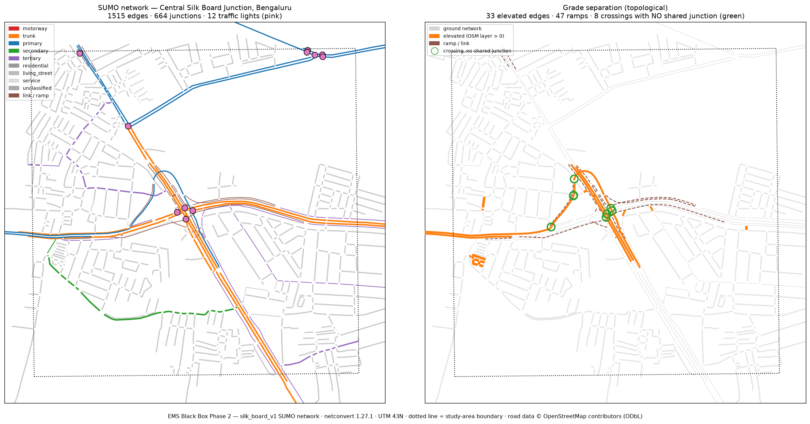

# Phase 2: OSM → SUMO network conversion

The validated SUMO road network for the Central Silk Board study area.

**Status:** built and validated — 18 checks, 0 errors, 1 warning. No traffic
demand, no ambulance, no simulation results. Those are Phases 3 and 4.



*Left: the network as SUMO will simulate it — road hierarchy, 12 traffic lights
(pink), study-area boundary dotted. Right: grade separation. Elevated edges
(orange) over the ground network, ramps dashed, and green circles at the 8
places where an elevated edge crosses a ground edge **without sharing a
junction**. Those circles are the property the whole study depends on.*

---

## 1. SUMO binaries used

Resolved by `ems_sim.runner.sumo_env`, never taken from `PATH`. On this machine
`/usr/local/bin/sumo` is a symlink to the **GUI launcher**, which starts
sumo-gui in the background and returns immediately — a headless run through it
reports success while simulating nothing.

| Tool | Absolute path | Version |
|---|---|---|
| `netconvert` | `/Library/Frameworks/EclipseSUMO.framework/Versions/Current/EclipseSUMO/share/sumo/bin/netconvert` | 1.27.1 |
| `sumo` | `…/share/sumo/bin/sumo` | 1.27.1 |
| `netedit` | `…/share/sumo/bin/netedit` | 1.27.1 |

`SUMO_HOME` = `/Library/Frameworks/EclipseSUMO.framework/Versions/Current/EclipseSUMO/share/sumo`,
exported into the netconvert subprocess by the pipeline. Without it netconvert
falls back to built-in type maps *and silently disables XML validation* — it
says so in a warning that is easy to miss.

---

## 2. Design: why netconvert reads the raw OSM

netconvert's OSM importer is the component that understands OSM semantics —
`layer` and `bridge` tags, `type=restriction` relations, `lanes:forward`,
`turn:lanes`, junction clustering, and signal nodes that sit on approach ways
rather than junction centres. Feeding it the Phase 1 GeoPackage would mean
re-encoding all of that into SUMO plain XML by hand: a second, worse OSM
importer.

So the raw extract is the input, and the Phase 1 tables get a better job:

```
data/raw/silk_board_v1.osm.xml ──netconvert──► silk_board_v1.net.xml
            │                                          │
            │ (Phase 1 parse)                      validation
            ▼                                          ▼
   data/processed/network.gpkg ────reference──────────►│
```

**Two independent parses of the same bytes** — this project's parser and
netconvert's — compared afterwards. A single-parser pipeline cannot notice
netconvert dropping a corridor; two can. That comparison is what found the one
warning this build reports (§9).

---

## 3. Conversion configuration

Committed at
[`simulation/sumo/silk_board_v1/silk_board_v1.netccfg`](../simulation/sumo/silk_board_v1/silk_board_v1.netccfg).
Rerun without going through any of this project's code:

```bash
"$SUMO_HOME/bin/netconvert" -c simulation/sumo/silk_board_v1/silk_board_v1.netccfg
```

Paths in it are relative **to the config file's own directory**, because that is
what netconvert resolves against — not the working directory.

| Option | Why |
|---|---|
| `--proj.utm` | UTM 43N; projection recorded in the net's `<location>` |
| `--keep-edges.in-geo-boundary` | Clip to the committed study-area bbox |
| `--keep-edges.by-vclass passenger` | Motor-vehicle network only |
| `--keep-edges.components 1` | Largest weakly connected component (see §7) |
| `--junctions.join`, `--junctions.join-dist 15` | OSM splits large Indian junctions into fragments |
| `--tls.guess-signals`, `--tls.guess-signals.dist 30` | All 18 OSM signal nodes have way-degree 1 — they sit on approach ways, set back from the junction |
| `--tls.join` | Cluster signal-controlled nodes |
| `--osm.turn-lanes` | Lane connections follow OSM, not geometric guesswork |
| `--osm.annotate-defaults` | **Mark every edge whose lanes/speed netconvert supplied** |
| `--output.original-names` | Keep OSM way IDs per lane — the join back to Phase 1 |
| `--output.street-names` | Keep names |
| `--geometry.remove` | Merge geometry-only nodes; topology unchanged |
| `--seed 42` | Determinism |

### Deliberately absent

- **`--flatten`** — removes all z-data. A guard in `sumo_convert.py` raises if
  anyone adds it, and a test asserts it is absent from the committed config.
- **`--ramps.guess`** — the extract has 39 real OSM `*_link` ways. Guessing
  would add ramps the source does not contain.
- **`--osm.layer-elevation`** — see §5.
- **`--print-options`** — it makes netconvert enumerate every option it supports
  and emit a deprecation warning for each legacy one: 34 warnings that have
  nothing to do with this network, burying the ones that do.

---

## 4. Results

| Metric | Value |
|---|---|
| **SUMO edges** | **1,515** |
| **Junctions** | **664** |
| **Traffic lights** | **12** |
| Internal (junction) edges | 5,159 |
| Lanes | 1,691 |
| Total edge length | 94.6 km |
| **Bridge / elevated edges** | **39** (traced to OSM `layer > 0`) |
| Ramp / link edges | 47 |
| **Disconnected components** | **1** (after pruning; 7 before) |
| Steepest gradient | 0.00% |
| Distinct OSM way IDs traceable | 489 |
| Edges with netconvert-supplied defaults | 1,389 / 1,515 |
| Projection | `+proj=utm +zone=43 +ellps=WGS84 +datum=WGS84` |

netconvert's own account: 1,386 nodes and 2,040 edges loaded, 591 geometry
nodes removed, 30 junction clusters joined, 7 components found and 6 removed
(182 edges).

---

## 5. Grade separation — the critical requirement

**Verified: 8 plan-view crossings between elevated and ground edges, 0 sharing a
junction.**

The finding that shaped this phase:

> **Grade separation in SUMO is topological, not vertical.**

Two ways are separated because they share no node — exactly how OSM encodes it,
and what netconvert preserves as distinct junctions. The z coordinate is
presentation.

That was established by converting both ways and validating each. Topology came
out **identical**: 1,681 edges, 745 junctions, 12 traffic lights, 39 elevated
edges, 47 ramps, and 8 crossings with 0 shared junctions in both.

The difference was cost. With `--osm.layer-elevation 5.5`, netconvert raises
each layer and reconstructs gradients — and where a layer transition falls on a
very short connector, the implied gradient is absurd:

| `--osm.layer-elevation` | Edges > 15% grade | Worst grade |
|---|---|---|
| 5.5 m | 32 | **1047%** |
| 2.0 m | 32 | 378% |
| disabled | **0** | **0%** |

The linear scaling identifies the cause: the worst edge is roughly 0.5 m long
with a full layer's rise across it. Neither `--geometry.max-grade.fix` nor
`--osm.layer-elevation.max-grade` constrained it.

**SUMO models grade resistance.** A 1047% gradient would not merely look wrong;
it would change the travel time measured across that edge — and travel time is
this project's headline output. Trading a corrupted measurement for a cosmetic
z is the wrong way round.

**The 3D view loses nothing.** OSM layer data is preserved in the Phase 1
tables, every SUMO lane carries its source OSM way ID, and the scene can apply a
clean per-layer offset — better than netconvert's reconstruction artefacts.

### How it is verified

`sumo_validate.check_grade_separation` finds every pair of edges at different
layers whose geometries cross in plan view and asserts they share no junction.
Ramps are excluded: connecting levels is their job.

A vacuity guard matters here — a test that found *zero* crossings would pass
while proving nothing, so the test asserts crossings were actually found.

All 15 Silk Board flyover / interchange OSM ways are present, including the
layer-2 `Silk Board Interchange` and the double-decker.

---

## 6. netconvert warnings — investigated

68 warnings, 0 errors. Full list in
`simulation/sumo/silk_board_v1/silk_board_v1.warnings.json`, grouped by cause
because netconvert emits one line per element.

| Category | Count | Finding |
|---|---|---|
| `pt_stop_dropped` | 12 | Public-transport stops on edges removed by the passenger-only filter. Out of scope; no road geometry affected. |
| `junction_join` | 10 | Reports of clusters being joined. Expected — that is the option's purpose. |
| **`turn_restriction_ignored`** | **8** | **Real limitation.** 4 relations whose direction netconvert could not determine (`18922630`, `19229116`, `20180295`, `20671043`), each producing 2 lines. Those turns stay legal in the network although they are restricted on the ground. |
| `sharp_angle` | 6 | Sharp turns (radius 3.5–7.5 m) at 5 edges, and connection speeds reduced accordingly. Plausible for tight Indian slip roads; flagged for human inspection. |
| **`tls_not_built`** | **6** | **Investigated.** 7 signal nodes control no links after clipping and filtering, so no traffic light was built for them. The 12 that remain cover the study area's signalised intersections. |
| `tls_program_failed` | 6 | Same 7 nodes: no links to control means no program. Consequence of the above, not a separate fault. |
| `non_road_type_discarded` | 3 | `waterway.drain`, `railway.proposed`, `usage.transmission`. Correct — not roads. |
| `intersecting_turns` | 2 | Overlapping left-turn paths at 2 junctions. Cosmetic unless vehicles deadlock; worth a look in netedit. |
| `summary_line` | 4 | netconvert's own "N total messages of type" roll-ups. |
| `other` | 11 | Connection speed reductions from turning radius, and one turnaround ambiguity at junction `9580225316`. |

Two warning classes were **eliminated rather than suppressed**, by fixing the
cause:

- **`SUMO_HOME is not set`** (2) — the pipeline now exports it into the
  subprocess. This also re-enabled XML validation, which netconvert had silently
  turned off.
- **`is deprecated`** (34) — caused by `--print-options`, which was removed.

---

## 7. Connectivity

Converted without pruning, the network has **7 weakly connected components**:
one of 1,515 edges (90.1%) and six fragments totalling 166 edges (10.2 km).

Before enabling `--keep-edges.components 1`, the fragments were inspected:

| Fragment | Edges | Composition |
|---|---|---|
| #1 | 118 | all residential |
| #2 | 32 | all residential |
| #3 | 8 | all residential |
| #4 | 4 | 2 residential + **2 tertiary (Sarjapura Road)** |
| #5, #6 | 2 each | residential |

All 31 Hosur Road edges, 27 Outer Ring Road edges, 39 elevated edges and 47
ramps are in the retained component.

Fragments are traps in a simulation network: a vehicle inserted in one cannot
route out, so it either fails to depart or teleports — and a teleport touching a
measured trip invalidates it. They were pruned, and netconvert's own report of
what it removed is parsed into the record rather than taken on trust.

---

## 8. Study-area containment

27 of 1,515 edges (1.8%, 3.2 km) lie entirely outside the study-area box. This
is by design: `--keep-edges.in-geo-boundary` keeps a way **whole** when any part
is inside, so boundary corridors extend beyond. The converted network's extent
is 3,735 × 2,073 m around a 1,600 × 1,600 m study area.

These are documented boundary connections, not modelled area. Demand in Phase 3
must not treat them as part of the study.

---

## 9. Validation results

**18 checks, 0 errors, 1 warning.** Report:
`simulation/sumo/silk_board_v1/silk_board_v1.validation.json`.

| Check | Result |
|---|---|
| `sumo_binary_loads_network` | PASS — loaded by the `sumo` binary, zero-step run |
| `network_has_edges` / `network_has_junctions` | PASS |
| `internal_links_present` | PASS — 5,159 |
| `projection_is_utm_43n` | PASS |
| `required_corridors_present` | PASS — Hosur 31, ORR 27, Silk Board Flyover 2, Double Decker 6 |
| **`flyover_grade_separated_from_ground`** | **PASS — 8 crossings, 0 shared junctions** |
| `elevated_edges_present` / `ramps_present` | PASS — 39 / 47 |
| `no_impossible_grades` | PASS — 0.00% |
| `no_catastrophic_fragmentation` | PASS — 1 component |
| `traffic_lights_built` | PASS — 12 |
| `netconvert_defaults_are_annotated` | PASS — 1,389 edges marked |
| `network_within_study_area` | PASS — 1.8% outside |
| **`major_ways_survive_conversion`** | **WARNING — see below** |
| `osm_traceability_preserved` | PASS — 489 way IDs |
| `phase1_cross_check`, `component_pruning_recorded` | INFO |

### The one warning

136 of 150 major OSM ways are traceable in the network. 13 of the 14 absent are
under 50 m — short stubs absorbed into joined junction clusters, which is what
joining does.

**The exception needs a human decision:** `way/457214835`, *Sarjapura Road*,
tertiary, **580 m**. It sits in pruned fragment #4 — OSM shows it disconnected
from the main network *within this study area*. Either it genuinely connects
only outside the box, or there is an OSM mapping gap. Sarjapura Road as a
corridor is present (15 primary edges, 3.38 km); this particular tertiary
segment is not.

---

## 10. Assumptions

Everything netconvert supplied that OSM did not:

1. **Traffic light programs are `ESTIMATED_DATA`.** Signal *locations* come from
   OSM. The phase durations and cycle structure were generated by netconvert
   from defaults. **No real Bengaluru signal timings exist in any source used
   here.** They must never be described as observed. Phase 4 replaces them, and
   the baseline they define is the denominator of every result this project will
   report.
2. **1,389 of 1,515 edges carry a netconvert-supplied lane count or speed.** OSM
   has lanes on 18% of edges and numeric speed limits on 12%. SUMO cannot
   simulate an edge without both, so substitution is unavoidable — keeping it
   visible is not. Every affected edge carries an `osmDefaults` parameter naming
   what was substituted.
3. **Junction joining at 15 m** is a modelling choice. It reassembles OSM's
   fragmented junctions; a different radius gives a different junction count.
4. **Signal guessing at 30 m** associates OSM approach-node signals with the
   junction they control. OSM asserts no such link.
5. **Elevation is not modelled.** Grade is 0 everywhere; see §5.
6. **Turn restrictions are incomplete** — 4 of the extract's relations were not
   applied, and OSM restriction coverage in Indian cities is thin to begin with.
7. **OSM centrelines are cartographic**, not survey data. The network inherits
   that and is not accurate to design tolerances.

---

## 11. Needs human inspection

Open `netedit` on the network and check:

```bash
"$SUMO_HOME/bin/netedit" simulation/sumo/silk_board_v1/silk_board_v1.net.xml
```

1. **Sarjapura Road `way/457214835`** (§9) — is the 580 m segment genuinely
   disconnected, or is this an OSM gap? If the latter, the fix belongs upstream
   in OSM or as a documented `ESTIMATED_DATA` correction.
2. **The 12 traffic lights** — do they sit at the intersections that actually
   matter, and did the 7 discarded ones matter? Phase 1 identified 5
   intersections with mapped signals.
3. **Flyover ramp connectivity** — do the ramps join the correct decks? The
   layer-2 `Silk Board Interchange` is a single OSM way.
4. **5 sharp turns** (radius 3.5–7.5 m) and **2 intersecting-left-turn
   junctions** — plausible for tight slip roads, or conversion artefacts?
5. **Junction joining at 15 m** — did any cluster over-merge? 30 were joined.
6. **The `(u/c)` flyover** carried over from Phase 1: `Ragigudda-Silk Board
   Integrated Flyover (u/c)` is in the drivable network. Decide whether it is
   open and record the decision.

---

## Reproducing

```bash
python scripts/build_sumo_network.py                 # convert + validate + provenance
python scripts/build_sumo_network.py --dry-run       # print the netconvert options
python scripts/build_sumo_network.py --validate-only # re-check the network on disk
python scripts/plot_sumo_network.py                  # regenerate the figure
```

### Files

| Path | Contents | Committed? |
|---|---|---|
| `simulation/sumo/silk_board_v1/silk_board_v1.netccfg` | The conversion recipe | **Yes** — it is an input |
| `simulation/sumo/silk_board_v1/silk_board_v1.net.xml` | The SUMO network (4.6 MB) | No — regenerable |
| `…/silk_board_v1.netconvert.log` | Full netconvert output, verbatim | No |
| `…/silk_board_v1.validation.json` | 18 checks + network statistics | No |
| `…/silk_board_v1.warnings.json` | All 68 warnings, grouped by cause | No |
| `data/provenance/silk_board_v1_sumo_network.json` | Provenance, chained to Phase 1 | **Yes** |
